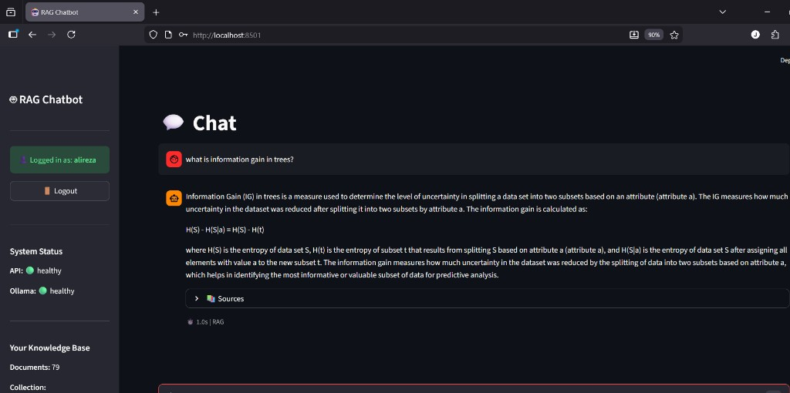

# RAG Chatbot API

A production-ready Retrieval-Augmented Generation (RAG) chatbot API built with FastAPI and local LLMs via Ollama. Designed for on-premise deployment with a focus on data privacy and security.



## Features

- **RAG Pipeline**: Full retrieval-augmented generation with document chunking, embedding, and context-aware responses
- **Local LLM**: Uses Ollama for on-premise LLM inference (no cloud dependency)
- **JWT Authentication**: Secure user authentication with isolated knowledge bases
- **Multi-tenant**: Each user has their own private document collection
- **PDF Support**: Upload and process PDF, TXT, and Markdown files
- **Modern UI**: Streamlit-based chat interface
- **Docker Ready**: Containerized deployment support

## Architecture

```
┌─────────────────────────────────────────────────────────────┐
│                        Client                                │
└─────────────────────────┬───────────────────────────────────┘
                          │ HTTP/REST
┌─────────────────────────▼───────────────────────────────────┐
│                    FastAPI Server                            │
│  ┌─────────────┐  ┌─────────────┐  ┌─────────────────────┐ │
│  │   /chat     │  │  /ingest    │  │      /health        │ │
│  └──────┬──────┘  └──────┬──────┘  └─────────────────────┘ │
└─────────┼────────────────┼──────────────────────────────────┘
          │                │
┌─────────▼────────────────▼──────────────────────────────────┐
│                     RAG Engine                               │
│  ┌─────────────┐  ┌─────────────┐  ┌─────────────────────┐ │
│  │  Retriever  │  │  Embedder   │  │   Text Processor    │ │
│  └──────┬──────┘  └──────┬──────┘  └─────────────────────┘ │
└─────────┼────────────────┼──────────────────────────────────┘
          │                │
┌─────────▼────────┐ ┌─────▼──────────────────────────────────┐
│   Vector Store   │ │            Ollama (LLM)                │
│    (NumPy)       │ │         tinyllama / llama3             │
└──────────────────┘ └────────────────────────────────────────┘
```

## Quick Start

### Prerequisites

- Python 3.11+
- Ollama installed ([ollama.com](https://ollama.com))

### Installation

```bash
# Clone the repository
git clone https://github.com/alirezasaberi20/rag-proj.git
cd rag-proj

# Create virtual environment
python -m venv venv
source venv/bin/activate  # On Windows: venv\Scripts\activate

# Install dependencies
pip install -r requirements.txt

# Copy environment file
cp .env.example .env
```

### Start Ollama

**On Linux/macOS:**
```bash
ollama serve
ollama pull tinyllama
```

**On Windows (or WSL accessing Windows Ollama):**

If running Ollama on Windows and accessing from WSL, you need to bind to all interfaces:

```powershell
# PowerShell - set Ollama to listen on all interfaces
$env:OLLAMA_HOST="0.0.0.0:11434"
ollama serve
```

Then pull a model in another terminal:
```powershell
ollama pull tinyllama
```

**For WSL users:** Update `OLLAMA_BASE_URL` in `.env` to your Windows host IP:
```bash
# Find Windows IP from WSL
ip route show default | awk '{print $3}'
# Then update .env: OLLAMA_BASE_URL=http://<windows-ip>:11434
```

### Run the API

```bash
uvicorn app.main:app --reload --host 0.0.0.0 --port 8000
```

### Run the UI (Optional)

```bash
streamlit run ui/streamlit_app.py
```

Open http://localhost:8501 in your browser.

## API Endpoints

### Authentication

```bash
# Register
curl -X POST http://localhost:8000/api/v1/auth/register \
  -H "Content-Type: application/json" \
  -d '{"username": "user1", "password": "password123"}'

# Login
curl -X POST http://localhost:8000/api/v1/auth/login \
  -d "username=user1&password=password123"
```

### Chat

```bash
# RAG-based chat (requires auth token)
curl -X POST http://localhost:8000/api/v1/chat \
  -H "Authorization: Bearer <token>" \
  -H "Content-Type: application/json" \
  -d '{"message": "What is machine learning?"}'
```

### Document Management

```bash
# Upload PDF
curl -X POST http://localhost:8000/api/v1/documents/upload \
  -H "Authorization: Bearer <token>" \
  -F "file=@document.pdf"

# Ingest text
curl -X POST http://localhost:8000/api/v1/documents/ingest \
  -H "Authorization: Bearer <token>" \
  -H "Content-Type: application/json" \
  -d '{"documents": [{"content": "Your text here", "metadata": {"source": "manual"}}]}'
```

## Project Structure

```
rag-proj/
├── app/
│   ├── __init__.py
│   ├── main.py                 # FastAPI application
│   ├── core/
│   │   ├── config.py           # Configuration management
│   │   ├── logging.py          # Logging setup
│   │   ├── exceptions.py       # Custom exceptions
│   │   └── security.py         # JWT authentication
│   ├── models/
│   │   ├── schemas.py          # Pydantic models
│   │   └── user.py             # User models
│   ├── services/
│   │   ├── text_processor.py   # Document chunking
│   │   ├── embedding_service.py # Text embeddings
│   │   ├── vector_store.py     # Vector storage
│   │   ├── llm_service.py      # Ollama integration
│   │   ├── rag_engine.py       # RAG orchestration
│   │   ├── document_loader.py  # PDF/file loading
│   │   └── user_service.py     # User management
│   └── api/
│       ├── dependencies.py     # Auth dependencies
│       └── v1/
│           ├── routes.py       # Chat & document endpoints
│           ├── auth.py         # Auth endpoints
│           └── health.py       # Health checks
├── ui/
│   └── streamlit_app.py        # Chat UI
├── data/
│   ├── vectorstore/            # Document embeddings
│   └── documents/              # Uploaded files
├── Dockerfile
├── docker-compose.yml
├── requirements.txt
└── README.md
```

## Configuration

Environment variables (`.env`):

| Variable | Default | Description |
|----------|---------|-------------|
| `OLLAMA_BASE_URL` | `http://localhost:11434` | Ollama server URL |
| `OLLAMA_MODEL` | `tinyllama` | LLM model name |
| `EMBEDDING_MODEL` | `all-MiniLM-L6-v2` | Sentence transformer model |
| `CHUNK_SIZE` | `500` | Document chunk size |
| `RETRIEVAL_TOP_K` | `3` | Number of documents to retrieve |

## Docker Deployment

```bash
# Build and run
docker-compose up -d

# Check logs
docker-compose logs -f chatbot-api
```

## License

MIT
